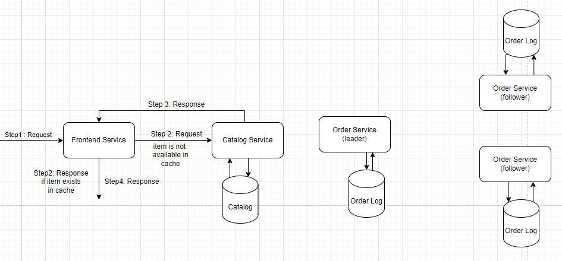
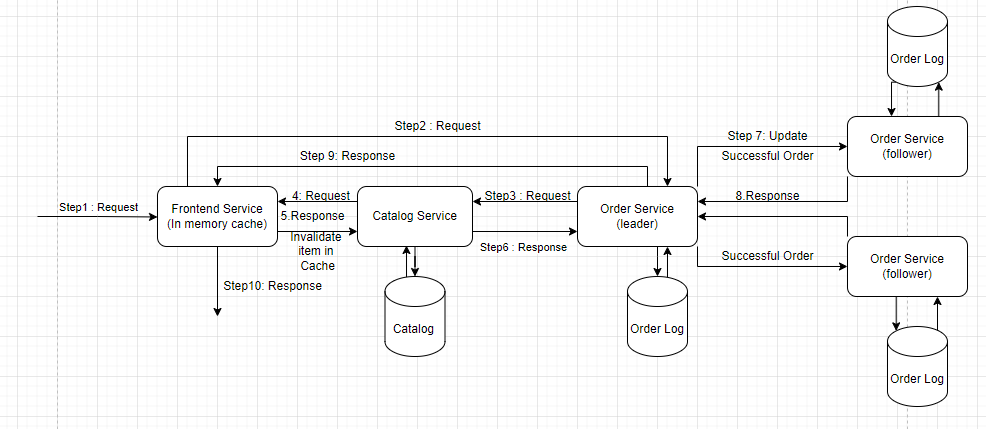
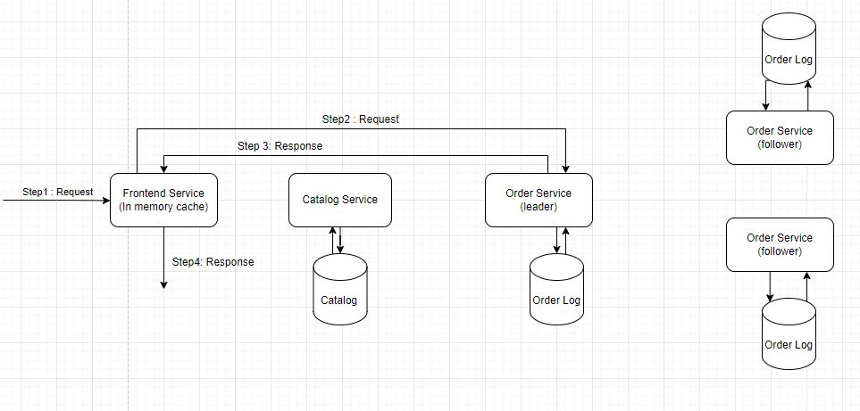

This document provides design overview

### Overview:

The Multi-Tiered Toy Store is implemented using three different Microservices.

- Frontend (1 replica)
- Catalog  (1 replica)
- Order    (3 replicas)

These Microservices communicate with each other using sockets. The client requests land on Frontend service which in turn communicate with Catalog and
Order services to handle them. All these services run in Multi-threaded mode with fixed pool size (10). Frontend service uses a thread-per-session model
whereas Catalog and Order services use thread-per-request model. When starting the toy story, services are started as per the following order:

1. Catalog service
2. All 3 order service replicas
3. Frontend service

#### When services are initialised

#### Catalog Service:

- All the item stocks are updated to 100 in the catalog data file

#### Frontend service:

- Contains order services unique ids(passes in the command args as {order_replica_port_number1,order_replica_port_number2, order_replica_port_number3})
- Need to choose the active order service with the highest id. To do so, it sends request with message("method_name": "health_check")
  order service with the highest id.
    - If frontend receives message: "Success" succeeds, this order service is picked as a leader
    - else, frontend service pings the order service with next highest-id. The above steps is repeated until it finds the leader.

Once the leader has been chosen, frontend service will notify other order replicas by sending message("method_name": "update_leader", "
leader_id": '{}").

#### Order service:

- Each order replica is assigned with the unique id(we use different port numbers for each replica) and also contains order replicas network placement(
  these will be passed in the command args like {order_replica_port_number1} {order_replica_port_number1,order_replica_port_number2,
  order_replica_port_number3})
- Each order replica tries to communicate with the nearest order replica for data consistency. If the communication fails, it goes to next nearest one.

Has order log file to track the order details

### Handling when order service crashes(fault tolerance):

- If Follower order replica crashes, there is nothing much to do since it is not the one communicating with frontend service
- If Leader order replica crashes, frontend service needs to do leader election using ("method_name": "health_check") to select the order service for
  processing the client requests.
- If no order service is up, the frontend service will send internal server error code to client.

### Handling when order replica is up after crashing:

- Communicates with active order replica by its latest order which is created previously in its order log and fetches the later order details from that
  replica and updates the order log

### Flow Diagram:

#### For Query Request:

#### For Order Request:

#### For Order Details:

### Services Overview:

### Frontend Service:

This service provides the interface for clients to interact with the application. The clients communicate with this service using HTTP-based REST APIs.
Currently, it handles three kinds of requests.

- GET /products/{item_name} -> provides the details of the given toy[Query Request]. When requests are made on this route it processes the requests by
  communicating with the Catalog Service.
- POST /order -> places an order for the given toy [Buy Request]. When requests are made on this route it processes the request by communicating with the
  Order Service. If other kinds of requests are made, this service returns an error response.
- GET /order/{order_id} -> provides the details of the given order_id[Order Query Request]. When requests are made on this route it processes the requests
  by communicating with the Order Service.

_Response Format:_ For a given Query or Buy requests or Order details this service constructs the HTTP response with status and data to be sent back based
on the responses from Catalog & Order Services.

Caching is implemented in this service. Initially the Cache is empty, on every query request if the toy information is not present in the Cache it fetches
the corresponding toy information from the Catalog Service. The information of a particular toy is removed from Cache when received an invalidation request
from Catalog Service.

### Catalog Service:

Provides services to view and manipulate the items of the Toy Store. It loads the current catalog state of the Toy Store from a disk file when it is booted
and stores it in memory. It processes the request based on this in memory copy of the catalog.

##### Functionality Provided:

- Provides a read service that returns information about the given toy. The read operation is synchronized using the Read Locks.
- Provides an update service to place an order. The order is validated before the changes are made. If an order is valid it updates the in memory copy of
  the catalog data and write out the in memory contents to the disk. This update operation is synchronized using Write Locks.
- For every 10 seconds, an in process scheduler runs and updates an item with quantity to 100 and for every item that is restocked invalidation requests are sent to
  the Frontend Service using server-push technique.

### Order Service:

Provides functionality to place an order for the requested item. It receives request from Frontend Service and communicates with the Catalog Service to
process the order. It fetches the current order_number of the Toy Store from the orders log file on disk. If it can't find the log file it will set the
order_number to 0.

##### Functionality Provided:

- Validates the requested order quantity. If it's not valid, it will send an error message to the front-end service.
- Forward the order to the Catalog Service
    - If a Success message was received from the Catalog service, it will increment the order_number and send the updated order_number as an output to the
      Frontend service. Before sending, it will make an entry in the orders log file. The log entry creation is synchronized using Write Locks.
    - If a failure message was received from the Catalog service, it will send an error message to the Frontend service.

### Client

The client communicates with Frontend service to get the product details or to initiate a buy request.

##### Query Catalog:

`Request: GET {host}:8081/products/{item_name}`

If item is not available, it receives response with error object

Sample response: `{'error': {'code': 404, 'message': 'product not found'}}`

If item is available, it receives response with data object

Sample response: `{'data': {'name': 'Tux', 'price': 19.9, 'quantity': 802}}`

##### Buy item:

`Request: POST {host}:8081/orders Request body: {"name" : "Tux",
"quantity" : 1}`

If item is invalid and requested quantity is within the data, order will be placed and receives response will be as follows

Sample response: `{'data': {'order_number': 192}}`

else, it receives error response

Sample response: `{'error': {'code': 404, 'message': "couldn't place the order"}}`

##### Get order details:

To fetch order details for the corresponding order id
`
Request: GET {host}:8081/orders/{order_id}
`

Sample response: `{"number": {}, "name": {}, "quantity": {}}`

