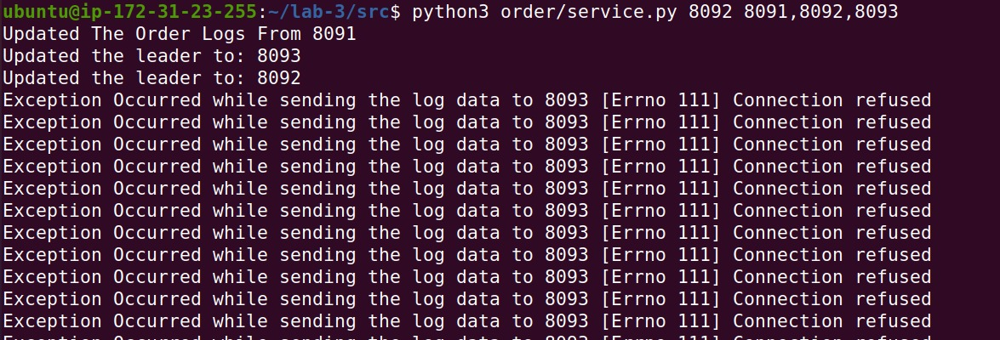

### Fault Tolerance

Client does not notice any failures when the follower order replica or leader order replica is crashed. All the order service replica ended up with the
same order(database) file when the replica came back. The experiment results are shown below:

Steps followed:

1. Catalog service started
2. Order replicas with id 8091, 8092, 8093 is started
3. Frontend service is started.

When the frontend service started, it has chosen the 8093 as leader and all replicas has been notified.

Cases tested:

1. Leader is down:

- Terminated replica3 (8093). Frontend service looks after the next highest replica as a leader and chose 8092. Later notified replica 1 with 8092 as new
  leader. And still client requests are processed.

2. Follower replica is down

- Terminated replica2 (8091). Since it is not leader, there is no leader selection needed.

3. Replica is up

- When 8091 is up, it requests for other replicas. It picks the 8092 and gets the latest order details which are after its latest order id prevailed
  previously.

#### Client Terminal

#### Frontend Service Terminal

#### Order replica 1 Terminal

#### Order replica 2 Terminal

#### Order replica 3 Terminal

### Performance comparison

### Average response time with no cache

### Average response time with cache

When the buy requests probability is low(less than 20%), frontend with caching has better performance than without caching. As the probability increases,
caching on frontend does not show improvement because when the order gets placed, the cache has to invalidate the item for data consistency. This will be
handled by the catalog service when there is an update to an item, it sends a request to invalidate the item in Frontend cache.
(simply, more orders leads less cache data and more requests are sent to Catalog service)

